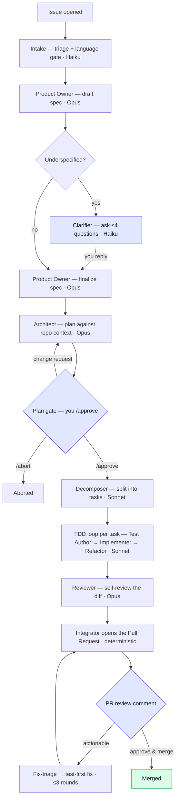

# Tsukinome

A GitHub-native agent that turns a natural-language issue into a high-quality, **test-first
pull request** — installable on any **TypeScript, JavaScript, or Python** repo, with **no
per-repo config files**.

Open an issue describing what you want. Tsukinome acknowledges it, drafts a spec (asking
clarifying questions only if it must), proposes a plan for you to approve, then implements it
test-first — writing a failing test, making it pass, one commit per task — and opens a
self-reviewed PR. Every run's cost is measured and capped. The whole thing is reviewable in
GitHub; there's no external dashboard.

## How it works

```
issue ─► acknowledge ─► spec ─►(clarify?)─► plan ─►[you /approve]─► TDD implement ─► review ─► PR
```

The full workflow, with the human gates (highlighted) and the model tier each stage runs on:



The blue nodes are where **you** are in the loop — answering clarifications, approving the plan,
and reviewing the PR. Everything else runs on its own.

- **Clarification gate** (conditional): if the issue is underspecified, Tsukinome asks one
  batched set of questions and waits for your reply.
- **Plan gate** (always): it commits a `plan.md` and waits for `/approve` (or `/abort`, or a
  change request) before writing any code.
- **The PR** is the final gate — review and merge as usual. Comment to request changes and
  Tsukinome runs a bounded, test-first fix loop.

The agents only ever produce structured output; **all git writes go through deterministic
code** (the Integrator) using a least-privilege token. See [`docs/security.md`](docs/security.md).

## Supported repos

| Language | Test runner | Notes |
| --- | --- | --- |
| TypeScript / JavaScript | `npm test` (vitest, jest, …) | Installs with `npm ci`. |
| Python | `pytest` | Installs best-effort: `pip install -e .` → `requirements.txt`. |

Detection is automatic from the repo's primary language — **no config file needed**. A repo in
any other language is refused gracefully with a comment (nothing is changed). Support is a
"language pack" per toolchain (`src/toolchain/`), so adding a language is additive.

---

# Getting started (using Tsukinome)

If someone is already running an instance, using it takes about two minutes.

### 1. Install the App

Open the App's page on GitHub and click **Install**, then choose the repos you want it on.
**Nothing is added to your repo** — Tsukinome keeps its spec/plan artifacts on its own
`tsukinome/issue-<n>` working branch.

### 2. Connect your Anthropic key

Right after installing, GitHub sends you to Tsukinome's **setup page**. Sign in with GitHub
(this proves you manage the installation), then paste your **Anthropic API key**. It's validated
on the spot, then encrypted and stored.

> **You bring your own key**, so model usage is billed to *you*, not to whoever hosts the
> instance. The key is encrypted at rest (AES-256-GCM), never logged or shown again, and is
> **purged automatically if you uninstall**. Re-visit the same page any time to rotate it.

If you skip this step, nothing breaks: your first issue gets a comment linking back to the setup
page, and **no tokens are spent** until a key is on file.

### 3. Open an issue

Describe what you want in plain language. From there:

1. Tsukinome acknowledges and drafts a spec (asking clarifying questions only if it must).
2. It commits a `plan.md` and waits — reply **`/approve`** to proceed, **`/abort`** to stop, or
   just describe what to change.
3. It implements test-first, one commit per task, and opens a **PR with a self-review and a cost
   summary**.
4. Review it like any PR. Leave review comments and it runs a bounded, test-first fix loop.

Every run is capped by a per-run budget and stops gracefully if it's hit.

---

# Running your own instance

Tsukinome is a GitHub App backed by one small Node service (Probot + Postgres). Full
step-by-step instructions — creating the App, its permissions/events, OAuth for the setup page,
and provisioning Postgres + pgvector — are in **[`docs/setup.md`](docs/setup.md)**. The short
version:

### Prerequisites

- Node.js ≥ 22
- Postgres with **pgvector** (Neon works; locally `pgvector/pgvector:pg16`)
- An **E2B** API key (the sandbox that clones repos and runs their tests)
- A GitHub App (see `docs/setup.md` for permissions + events)
- An Anthropic API key — for the operator fallback, or let each installation bring its own

### Configure

All configuration is environment variables; there are no config files. The essentials:

| Variable | Required | Default | Purpose |
| --- | --- | --- | --- |
| `APP_ID`, `PRIVATE_KEY`, `WEBHOOK_SECRET` | yes | — | GitHub App credentials. |
| `DATABASE_URL` | yes | — | Postgres (pgvector-capable). |
| `E2B_API_KEY` | yes | — | Sandbox for clone + test runs. |
| `MASTER_ENCRYPTION_KEY` | yes | — | Base64, **32 bytes** (`openssl rand -base64 32`). Encrypts stored per-installation keys. |
| `GITHUB_CLIENT_ID` / `GITHUB_CLIENT_SECRET` / `SETUP_BASE_URL` | for the setup page | — | Enables the bring-your-own-key page. Unset → `/setup` shows a "not configured" notice. |
| `ANTHROPIC_API_KEY` | fallback only | — | Operator key; used only with the flag below. |
| `ALLOW_PLATFORM_KEY_FALLBACK` | no | `false` | `true` → installations with no key on file use the operator key (self-host / dev). |
| `E2B_TEMPLATE` | recommended | base image | Sandbox image pinned to Node ≥ 22 (and Python 3 for Python repos). |
| `RUN_BUDGET_USD` | no | `1.00` | Per-run model-spend ceiling. |
| `PORT` | no | `3000` | HTTP port. |

> Key resolution order is **installation's stored key → operator fallback → refuse**. For solo
> dev, set `ALLOW_PLATFORM_KEY_FALLBACK=true` with your own `ANTHROPIC_API_KEY` and skip the
> setup page entirely.

### Run

```bash
npm install
npm run migrate up        # apply database migrations
npm start                 # webhooks + worker in one process
```

`GET /health` returns `200`. Webhooks land on `/api/github/webhooks`; the setup page is at
`/setup`.

### Local development

```bash
npm run dev:smee          # terminal 1 — needs SMEE_URL (your smee.io channel)
npm run dev               # terminal 2 — tsx watch, server + worker
```

`SETUP_BASE_URL=http://localhost:3000` is fine for testing the setup page yourself — the OAuth
redirect happens in *your* browser, so no tunnel is needed. A public URL is only required once
**other people** need to reach your setup page.

### Observability

- Each completed run posts a **cost summary** (total + per-role breakdown) in the PR body and
  an issue comment; spend is capped by `RUN_BUDGET_USD`.
- `npm run debug:cost-metrics` prints the **measured average cost per issue** across all runs.

---

# Developing Tsukinome

This repo is built by **Claude Code**, phase by phase, following `docs/implementation-plan.md`.

- `docs/implementation-plan.md` — the full phased build plan.
- `CLAUDE.md` — the working agreement and locked decisions (auto-loaded each session).
- `PROGRESS.md` — current status, decisions, and log.
- `.claude/commands/` — `/phase-report` helper.

```bash
npm test          # unit tests (gated integration suites skip without their keys/DB)
npm run lint
npm run typecheck
```
